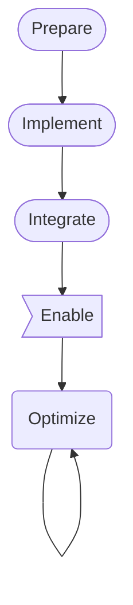

1.  (Prepare)
Create the supporting functions needed by element naming and the algorithm.
These are simply libraries with good unit testing to ensure they are accurate when used later.
**FreeCAD behavior is unchanged for users**
2. (Implement)
Create the naming-of-elements algorithm.
Create the ElementMap class.
Using the previous libraries, import the general algorithm that will _eventually_ be called by ComplexGeoData.cpp to have the more advanced naming.
Using unit tests, verify that the naming is very predictable and reliable.
**FreeCAD behavior is unchanged for users**
3. (Integrate)
Add the naming, but do not use it yet.
Add the members to the ComplexGeoData.cpp class.
While the member values are set, they are not actually used.
Add support for visibility in the Selection View.
   **This stage will slow down FreeCAD and will make the naming visible on an element when selected.**
4. (Enable)
Use the toponaming so that the model is more resilient to upstream object changes.
**Users will start seeing increased stability.  Performance is still impacted**
5. (Optimize)
Selectively add optimizations to speed FreeCAD up again.
This could include: MappedName-hashing and IndexedName-int:string-caching.
**Repeat**
```
